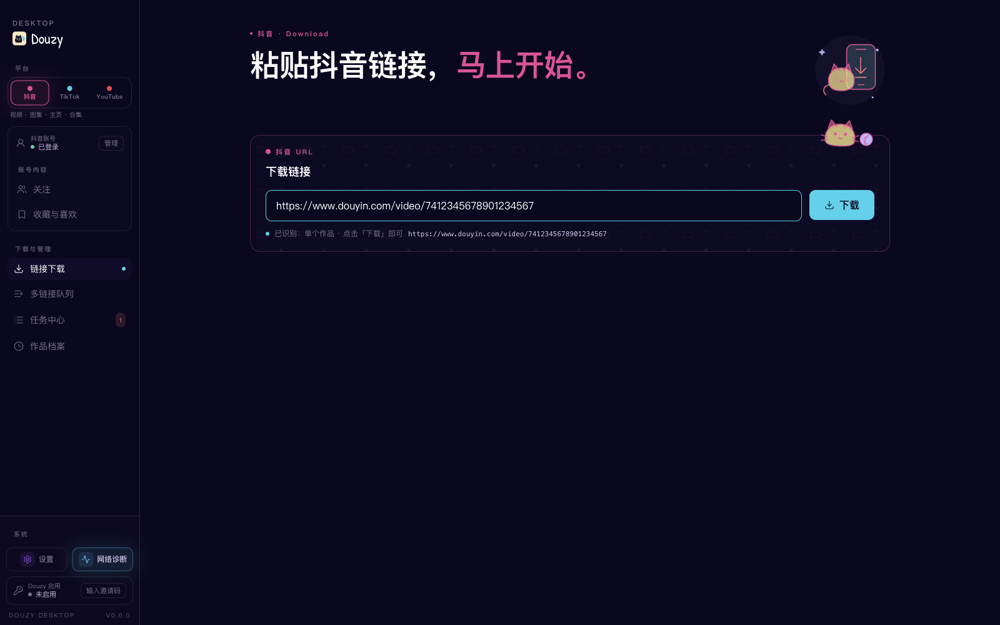
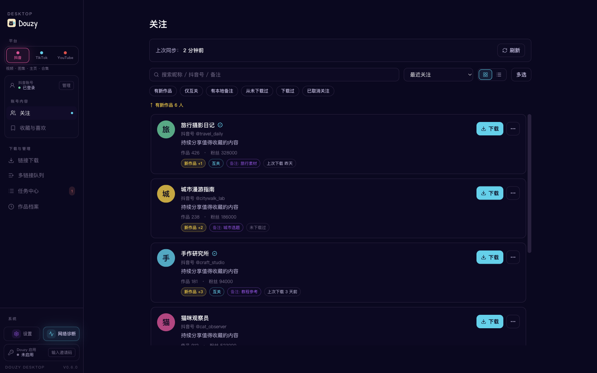
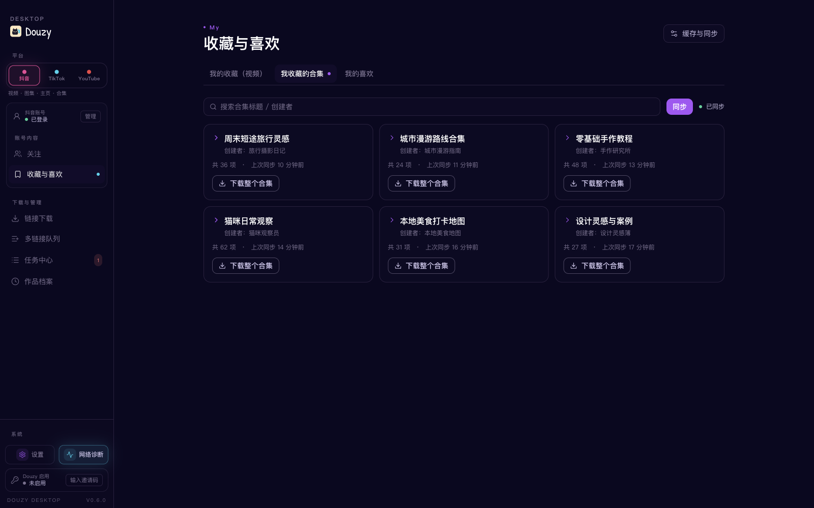
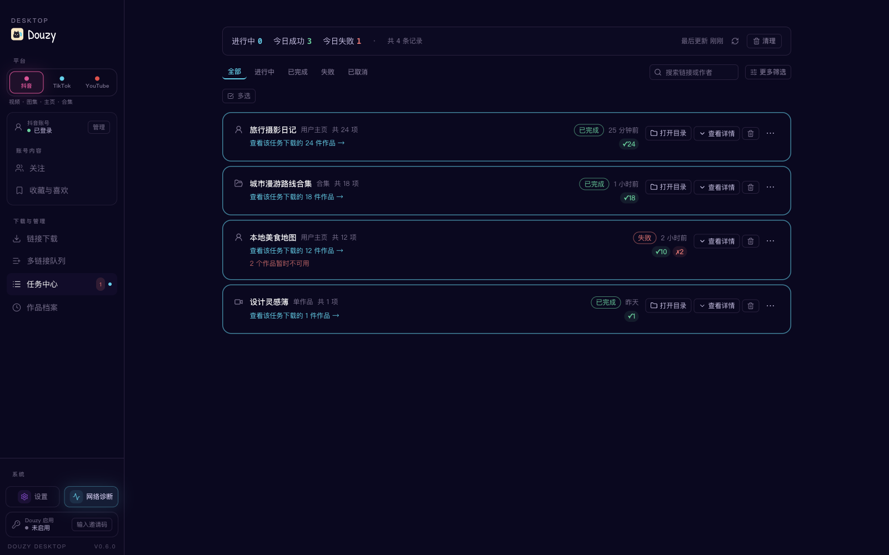

# Douyin Downloader V2.0

<p align="center">
  
</p>

<p align="center">
    <a href="https://linux.do" alt="LINUX DO">
        </a>
</p>
中文文档 (Chinese): [README.zh-CN.md](./README.zh-CN.md)


A practical Douyin downloader supporting videos, image-notes, collections, music, favorites collections, and profile batch downloads, with progress display, retries, SQLite deduplication, download integrity checks, and browser fallback support.

## Desktop App (Douzy)

A desktop GUI built on the same backend — paste a link to start, sync your following list, and track downloads visually.

> **Beta:** The desktop app is currently in closed beta. To try it, download the build from the [Releases](https://github.com/jiji262/douyin-downloader/releases) page.

<table>
  <tr>
    <td width="33%"><br/><sub>Download · paste a link to start</sub></td>
    <td width="33%"><br/><sub>Following · synced creator list</sub></td>
    <td width="33%"><br/><sub>Task Center · per-job status</sub></td>
  </tr>
  <tr>
    <td width="33%"><br/><sub>Archive · SQLite history & filters</sub></td>
    <td width="33%"><br/><sub>Settings · naming templates</sub></td>
    <td width="33%"><br/><sub>Live progress · per-job event log</sub></td>
  </tr>
</table>

## Feature Overview

### Supported

| Feature | Description |
|---------|-------------|
| Single video download | `/video/{aweme_id}` |
| Single image-note download | `/note/{note_id}` and `/gallery/{note_id}` |
| Single collection download | `/collection/{mix_id}` and `/mix/{mix_id}` |
| Single music download | `/music/{music_id}` (prefers direct audio, fallback to first related aweme) |
| Short link parsing | `https://v.douyin.com/...`, `v.iesdouyin.com`, bare hosts |
| Profile batch download | `/user/{sec_uid}` + `mode: [post, like, mix, music]` |
| Logged-in favorites collections | `/user/self?showTab=favorite_collection` + `mode: [collect, collectmix]` |
| No-watermark preferred | Automatically selects watermark-free video source |
| Highest-quality selection | Auto-picks highest bitrate from `video.bit_rate` ladder (video + live-photo) |
| **Live stream recording** | `live.douyin.com/{room_id}` → FLV/HLS, preserves partial data on stream end |
| **Comments collection** | Per-aweme comments (+ optional replies) saved as `*_comments.json` |
| **Hot search + keyword search** | `--hot-board [N]` / `--search "keyword"` dumps to JSONL |
| **REST API server mode** | `--serve --serve-port 8000` (optional `fastapi + uvicorn`) |
| **Notification push** | Bark / Telegram / Webhook on download completion |
| Extra assets | Cover, music, avatar, JSON metadata |
| Video transcription | Optional, using OpenAI Transcriptions API |
| Concurrent downloads | Configurable concurrency, default 5 |
| Retry with backoff | Exponential backoff (1s, 2s, 5s) |
| Rate limiting | Default 2 req/s |
| SQLite deduplication | Database + local file dual dedup |
| Incremental downloads | `increase.post/like/mix/music` |
| Time filters | `start_time` / `end_time` |
| Browser fallback | Launches browser when pagination is blocked, manual CAPTCHA supported |
| Download integrity check | Content-Length validation, auto-cleanup of incomplete files |
| Progress display | Rich progress bars, supports `progress.quiet_logs` quiet mode |
| Docker deployment | Dockerfile included |
| CI/CD | GitHub Actions for testing and linting |

### Current Limitations

- Browser fallback is fully validated for `post`; `like/mix/music` currently relies on API pagination
- `number.allmix` / `increase.allmix` are retained as compatibility aliases and normalized to `mix`
- `collect` / `collectmix` currently work for the account represented by the logged-in cookies only
- `collect` / `collectmix` must be used alone and cannot be combined with `post` / `like` / `mix` / `music`
- `increase` currently applies to `post` / `like` / `mix` / `music`; favorites collection modes do not support incremental stop
- Live stream recording saves FLV natively; HLS sources only save the playlist (use ffmpeg for playable output)
- The webcast room endpoint is not verified against every live scenario — treat as experimental

## Quick Start

### 1) Requirements

- Python 3.8+
- macOS / Linux / Windows

### 2) Install dependencies

```bash
pip install -r requirements.txt
```

For browser fallback and automatic cookie capture:

```bash
pip install playwright
python -m playwright install chromium
```

### 3) Copy config file

```bash
cp config.example.yml config.yml
```

### 4) Get cookies (recommended: automatic)

```bash
python -m tools.cookie_fetcher --config config.yml
```

After logging into Douyin, return to the terminal and press Enter. Cookies will be written to your config automatically.

### 5) Docker deployment (optional)

```bash
docker build -t douyin-downloader .
docker run -v $(pwd)/config.yml:/app/config.yml -v $(pwd)/Downloaded:/app/Downloaded douyin-downloader
```

## Minimal Working Config

```yaml
link:
  - https://www.douyin.com/user/MS4wLjABAAAAxxxx

path: ./Downloaded/
mode:
  - post

number:
  post: 0
  collect: 0
  collectmix: 0

thread: 5
retry_times: 3
proxy: ""
database: true
database_path: dy_downloader.db

progress:
  quiet_logs: true

cookies:
  msToken: ""
  ttwid: YOUR_TTWID
  odin_tt: YOUR_ODIN_TT
  passport_csrf_token: YOUR_CSRF_TOKEN
  sid_guard: ""

browser_fallback:
  enabled: true
  headless: false
  max_scrolls: 240
  idle_rounds: 8
  wait_timeout_seconds: 600

transcript:
  enabled: false
  model: gpt-4o-mini-transcribe
  output_dir: ""
  response_formats: ["txt", "json"]
  api_url: https://api.openai.com/v1/audio/transcriptions
  api_key_env: OPENAI_API_KEY
  api_key: ""
```

## Usage

### Run with a config file

```bash
python run.py -c config.yml
```

### Append CLI arguments

```bash
python run.py -c config.yml \
  -u "https://www.douyin.com/video/7604129988555574538" \
  -t 8 \
  -p ./Downloaded
```

### Arguments

| Argument | Description |
|----------|-------------|
| `-u, --url` | Append download link(s), can be repeated |
| `-c, --config` | Specify config file (default: `config.yml`) |
| `-p, --path` | Specify download directory |
| `-t, --thread` | Specify concurrency |
| `--show-warnings` | Show warning/error logs |
| `-v, --verbose` | Show info/warning/error logs |
| `--hot-board [N]` | Fetch Douyin hot search board and write JSONL; optional top-N |
| `--search KEYWORD` | Search videos by keyword, write JSONL |
| `--search-max N` | Max items for `--search` (default 50) |
| `--serve` | Run as REST API server (requires `pip install fastapi uvicorn`) |
| `--serve-host HOST` | REST server listen host (default 127.0.0.1) |
| `--serve-port PORT` | REST server listen port (default 8000) |
| `--version` | Show version number |

## Typical Scenarios

### Download one video

```yaml
link:
  - https://www.douyin.com/video/7604129988555574538
```

### Download one image-note

```yaml
link:
  - https://www.douyin.com/note/7341234567890123456
```

### Download a collection

```yaml
link:
  - https://www.douyin.com/collection/7341234567890123456
```

### Download a music track

```yaml
link:
  - https://www.douyin.com/music/7341234567890123456
```

### Batch download a creator's posts

```yaml
link:
  - https://www.douyin.com/user/MS4wLjABAAAAxxxx
mode:
  - post
number:
  post: 50
```

### Batch download a creator's liked posts

```yaml
link:
  - https://www.douyin.com/user/MS4wLjABAAAAxxxx
mode:
  - like
number:
  like: 0    # 0 means download all
```

### Download multiple modes at once

```yaml
link:
  - https://www.douyin.com/user/MS4wLjABAAAAxxxx
mode:
  - post
  - like
  - mix
  - music
```

Cross-mode deduplication: the same aweme_id won't be downloaded twice across different modes.

### Download logged-in favorites collection items

```yaml
link:
  - https://www.douyin.com/user/self?showTab=favorite_collection
mode:
  - collect
number:
  collect: 0
```

### Download logged-in collected mixes

```yaml
link:
  - https://www.douyin.com/user/self?showTab=favorite_collection
mode:
  - collectmix
number:
  collectmix: 0
```

### Record a live stream (experimental)

```yaml
link:
  - https://live.douyin.com/123456789   # or /follow/live/{room_id}
live:
  max_duration_seconds: 3600   # 0 = record until broadcaster ends
  chunk_size: 65536
  idle_timeout_seconds: 30
```

The recorder saves an FLV file under `Downloaded/{author}/live/` plus a `*_room.json`
metadata snapshot. If the broadcaster ends the stream, network goes idle, or you
Ctrl+C, any already-recorded bytes are preserved (the `.tmp` file is promoted to
the final file).

### Collect comments per aweme

```yaml
comments:
  enabled: true
  include_replies: false   # true will fetch each comment's second-level replies (extra API calls)
  max_comments: 500        # 0 = no cap
  page_size: 20
```

Generates a `{date}_{title}_{aweme_id}_comments.json` next to the media file.

### Dump the hot search board

```bash
python run.py --hot-board 30 -p ./Downloaded
# Output: ./Downloaded/hot_board/20260424_221530.jsonl
```

### Search by keyword

```bash
python run.py --search "猫咪" --search-max 100 -p ./Downloaded
# Output: ./Downloaded/search/猫咪_20260424_221530.jsonl
```

### Run as REST API server

```bash
pip install fastapi uvicorn       # one-time optional dep
python run.py --serve --serve-port 8000
```

Endpoints:

| Method | Path | Description |
|--------|------|-------------|
| POST | `/api/v1/download` | Submit `{"url": "..."}`, returns `{job_id, status}` |
| GET | `/api/v1/jobs/{job_id}` | Get a specific job's status/counts |
| GET | `/api/v1/jobs` | List recent jobs (TTL + capacity capped) |
| GET | `/api/v1/health` | Health probe |

Finished jobs are pruned by TTL (default 24h) and max-jobs (default 500) — in-flight jobs are never pruned. Configure via `server.max_jobs` / `server.job_ttl_seconds`.

### Send a notification on completion

```yaml
notifications:
  enabled: true
  on_success: true
  on_failure: true
  providers:
    - type: bark
      url: https://api.day.app/YOUR_DEVICE_KEY
      sound: bell
    - type: telegram
      bot_token: "123456:ABC..."
      chat_id: "987654321"
    - type: webhook                 # works with 企业微信/飞书/钉钉 bot URLs too
      url: https://qyapi.weixin.qq.com/cgi-bin/webhook/send?key=xxx
      extra_body:
        msgtype: text
```

All enabled providers are notified in parallel; a failing provider never blocks the download flow.


### Incremental download (only new items)

```yaml
increase:
  post: true
database: true    # incremental mode requires database
```

### Full crawl (no item limit)

```yaml
number:
  post: 0
```

## Optional Feature: Video Transcription (`transcript`)

Current behavior applies to **video items only** (image-note items do not generate transcripts).

### 1) Enable in config

```yaml
transcript:
  enabled: true
  model: gpt-4o-mini-transcribe
  output_dir: ""        # empty: same folder as video; non-empty: mirrored to target dir
  response_formats:
    - txt
    - json
  api_key_env: OPENAI_API_KEY
  api_key: ""           # can be set directly, or via environment variable
```

Recommended to provide key through environment variable:

```bash
export OPENAI_API_KEY="sk-xxxx"
```

### 2) Output files

When enabled, it generates:

- `xxx.transcript.txt`
- `xxx.transcript.json`

If `database: true`, job status is also recorded in SQLite table `transcript_job` (`success/failed/skipped`).

## Testing

Recommended:

```bash
python3 -m pytest -q
```

Plain `pytest` is also supported now:

```bash
pytest -q
```

## Key Config Fields

| Field | Description |
|-------|-------------|
| `mode` | Supports `post`/`like`/`mix`/`music`; logged-in favorites mode additionally supports standalone `collect`/`collectmix` |
| `number.post/like/mix/music/collect/collectmix` | Per-mode download limit, 0 = unlimited |
| `increase.post/like/mix/music` | Per-mode incremental toggle |
| `start_time` / `end_time` | Time filter (format: `YYYY-MM-DD`) |
| `folderstyle` | Create per-item subdirectories |
| `browser_fallback.*` | Browser fallback for `post` when pagination is restricted |
| `progress.quiet_logs` | Quiet logs during progress stage |
| `transcript.*` | Optional transcription after video download |
| `comments.*` | Per-aweme comments collection (opt-in) |
| `live.*` | Live stream recording options (max_duration_seconds / chunk_size / idle_timeout_seconds) |
| `notifications.*` | Bark/Telegram/Webhook push on completion |
| `server.*` | REST API server tuning (max_jobs, job_ttl_seconds) |
| `proxy` | Optional HTTP/HTTPS proxy setting |
| `database` | Enable SQLite deduplication and history |
| `database_path` | SQLite path, default is `dy_downloader.db` in the current working directory |
| `thread` | Concurrent download count |
| `retry_times` | Retry count on failure |

## Output Structure

Default with `folderstyle: true` and `database_path: dy_downloader.db`:

```text
workspace/
├── config.yml
├── dy_downloader.db          # default location when database: true
└── Downloaded/
    ├── download_manifest.jsonl
    ├── hot_board/                # when --hot-board is used
    │   └── 20260424_221530.jsonl
    ├── search/                   # when --search is used
    │   └── 猫咪_20260424_221530.jsonl
    └── AuthorName/
        ├── post/
        │   └── 2024-02-07_Title_aweme_id/
        │       ├── ...mp4
        │       ├── ..._cover.jpg
        │       ├── ..._music.mp3
        │       ├── ..._data.json
        │       ├── ..._avatar.jpg
        │       ├── ..._comments.json    # when comments.enabled
        │       ├── ...transcript.txt
        │       └── ...transcript.json
        ├── like/
        │   └── ...
        ├── mix/
        │   └── ...
        ├── music/
        │   └── ...
        ├── collect/
        │   └── ...
        ├── collectmix/
        │   └── ...
        └── live/                 # when recording live streams
            └── 2026-04-24_2215_LiveTitle_RoomId/
                ├── ...flv
                └── ..._room.json
```

## Re-downloading Content

The program uses a **database record + local file** dual check to decide whether to skip already-downloaded content. To force re-download, you need to clean up accordingly:

### Re-download a specific item

```bash
# Delete local files (folder name contains the aweme_id)
rm -rf Downloaded/AuthorName/post/*_<aweme_id>/

# Delete database record
sqlite3 dy_downloader.db "DELETE FROM aweme WHERE aweme_id = '<aweme_id>';"
```

### Re-download all items from a specific author

```bash
rm -rf Downloaded/AuthorName/
sqlite3 dy_downloader.db "DELETE FROM aweme WHERE author_name = 'AuthorName';"
```

### Full reset (re-download everything)

```bash
rm -rf Downloaded/
rm dy_downloader.db
```

> **Note:** Deleting only the database but keeping files will NOT trigger re-download — the program scans local filenames for aweme_id to detect existing downloads. Deleting only files but keeping the database WILL trigger re-download (the program treats "in DB but missing locally" as needing retry).

## FAQ

### 1) Why do I only get around 20 posts?

This is a common pagination risk-control behavior. Make sure:

- `browser_fallback.enabled: true`
- `browser_fallback.headless: false`
- complete verification manually in the browser popup, and do not close it too early

### 2) Why is the progress output noisy/repeated?

By default, `progress.quiet_logs: true` suppresses logs during progress stage.  
Use `--show-warnings` or `-v` temporarily when debugging.

### 3) What if cookies are expired?

Run:

```bash
python -m tools.cookie_fetcher --config config.yml
```

### 4) Why are transcript files not generated?

Check in order:

- whether `transcript.enabled` is `true`
- whether downloaded items are videos (image-notes are not transcribed)
- whether `OPENAI_API_KEY` (or `transcript.api_key`) is valid
- whether `response_formats` includes `txt` or `json`

### 5) How to view download history?

```bash
sqlite3 dy_downloader.db "SELECT aweme_id, title, author_name, datetime(download_time, 'unixepoch', 'localtime') FROM aweme ORDER BY download_time DESC LIMIT 20;"
```

## Community Group


点击链接加入群聊【QQ群】：[https://qm.qq.com/q/9xoNt8Wzv4](https://qm.qq.com/q/9xoNt8Wzv4)

## Disclaimer

This project is for technical research, learning, and personal data management only. Please use it legally and responsibly:

- Do not use it to infringe others' privacy, copyright, or other legal rights
- Do not use it for any illegal purpose
- Users are solely responsible for all risks and liabilities arising from usage
- If platform policies or interfaces change and features break, this is a normal technical risk

By continuing to use this project, you acknowledge and accept the statements above.

## License

This project is licensed under the MIT License. See [LICENSE](./LICENSE) for details.

## Friendly Links

- [LINUX DO](https://linux.do/)
